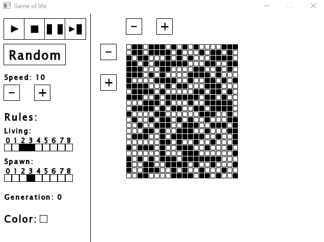
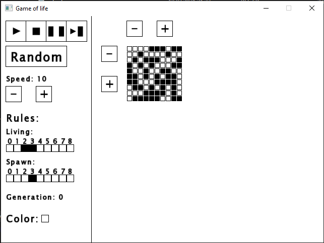
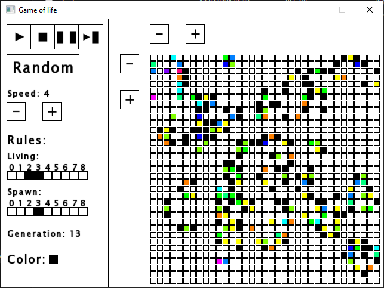

# Game of life

### About
This project is an implementation of The Game of Life cellular automata.

### Features
- Changing cells number
- Changing rules of the automata
- Colors indicating cell's age
- Generation counter

### Technologies
The project uses SFML 2 graphics library

### Screenshots

